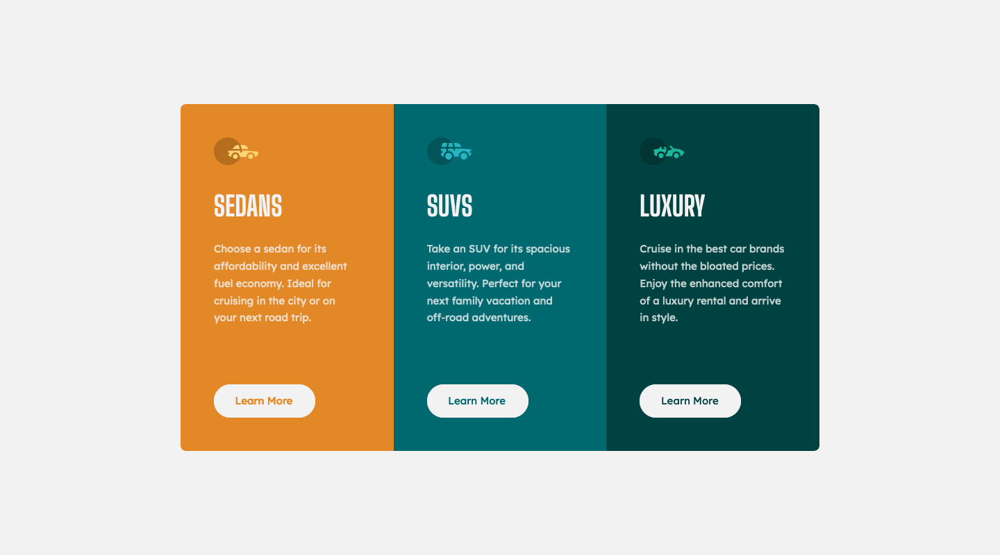

# Frontend Mentor - 3-Column Preview Card Component Solution

This is a solution to the [3-Column Preview Card Component Challenge on Frontend Mentor](https://www.frontendmentor.io/challenges/3column-preview-card-component-pH92eAR2-). Frontend Mentor challenges help you improve your coding skills by building realistic projects. 

## The challenge

Users should be able to:

- View the optimal layout depending on their device's screen size
- See hover states for interactive elements

## Screenshot



## Built with

- Semantic HTML5 markup
- CSS custom properties
- Flexbox
- CSS Grid
- Mobile-first workflow
- React

## What I learned

I have been following the freeCodeCamp React course and decided to create this page to practice what I have learnt so far.

I am pleased that I managed to get React to actually run in the first place. I built a component called 'Card' which represents one of the three sections on the page. I also used 'props' to add the information to each card, which is pulled from a separate data file.

```js
export default function Card(props) {
    return (
        <section className={`card card--${props.title.toLowerCase()}`}>
            <h2 className="card__title">{props.title}</h2>
            <p className="card__description">{props.description}</p>
            
            <button className="card__button" type="button">Learn More</button>
        </section>
    )
}
```

## Continued development

I will continue to work through the React course on freeCodeCamp. I know the next section talks about 'state', and I will perhaps pick another FEM project to practice this.

### Useful resources

[React Course - Beginner's Tutorial for React JavaScript Library [2022]](https://www.youtube.com/watch?v=bMknfKXIFA8) - This is the React course I am working through. It has been a big help.

